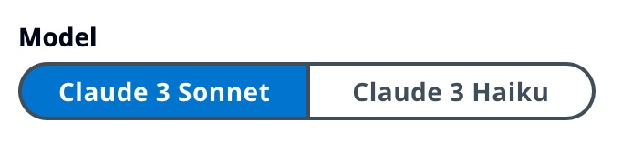
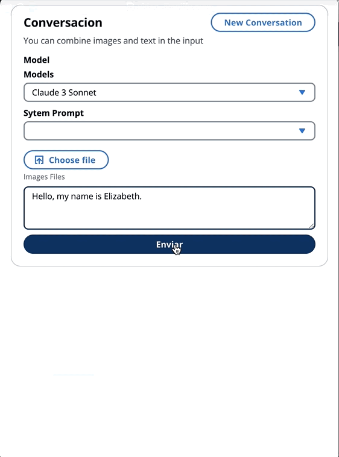
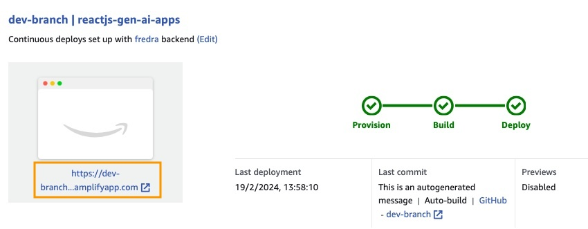
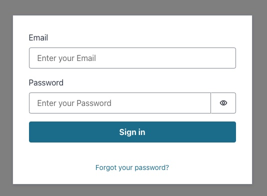
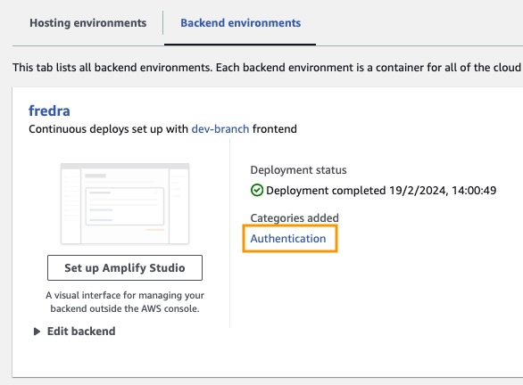
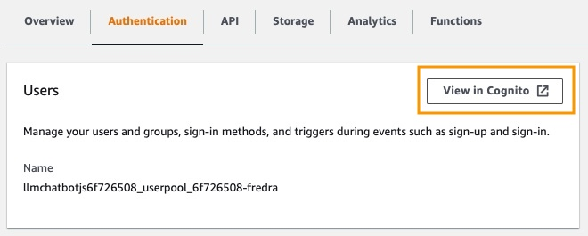
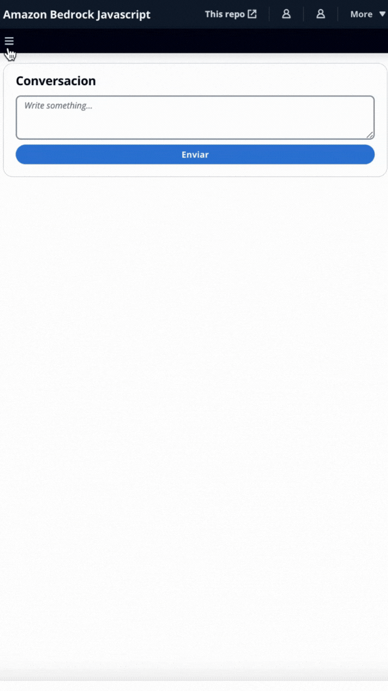

# Building reactjs Generative AI apps with Amazon Bedrock and AWS JavaScript SDK

This article was written in colaboration [Enrique Rodriguez](https://github.com/ensamblador) 

Integrating generative AI into existing applications presents challenges. Many developers have limited experience in training foundations models, but the aim is to integrate generative AI capabilities with minimal code changes.

To solve this, we created an application that integrates the power of generative AI with a call to the [Amazon Bedrock API](https://docs.aws.amazon.com/bedrock/latest/APIReference/welcome.html) from a web application such [SPA](https://developer.mozilla.org/en-US/docs/Glossary/SPA) built with JavaScript and react framework. With no middleware, lowering the barrier for incorporating AI generation through minimal code integration.

In this blog you will learn how to use [Amazon Cognito](https://aws.amazon.com/pm/cognito/) credentials and IAM Roles to invoke [Amazon Bedrock](https://aws.amazon.com/bedrock/) API in a react-based application with JavaScript and the [CloudScape](https://cloudscape.design/) design system. You will deploy all the resources and host the app using [AWS Amplify](https://aws.amazon.com/amplify/).


## How Does This Application Work?

In the [repository of this application](https://github.com/build-on-aws/building-reactjs-gen-ai-apps-with-amazon-bedrock-javascript-sdk/), you will find the code ready to deploy the backend and frontend.

✅ **Backend:** An Amazon Cognito User Pool and Identity Pool, with an [AWs Identity and Access Managemen Role](https://docs.aws.amazon.com/es_es/IAM/latest/UserGuide/id_roles.html) (IAM Role) that contains the policy with the permissions to invoke Amazon Bedrock.

```
{ policyName: "amplify-permissions-custom-resources",
            policyDocument: {
                Version: "2012-10-17",
                Statement: [
                    {
                        Resource: "*",
                        Action: ["bedrock:InvokeModel*", "bedrock:List*", "bedrock:Retrieve*"],
                        Effect: "Allow",
                    }
                ]
            }
        }
```

Check ["Integrating Amazon Cognito authentication and authorization with web and mobile apps" guide][https://docs.aws.amazon.com/cognito/latest/developerguide/cognito-integrate-apps.html] and can invoke API operations for users authentication and authorization. 

> This permissions can be customized here: [IAM Role Code](https://github.com/build-on-aws/building-reactjs-gen-ai-apps-with-amazon-bedrock-javascript-sdk/blob/main/reactjs-gen-ai-apps/amplify/backend/awscloudformation/override.ts)

✅ **Frontend:** a reactjs single page application (SPA) and  [CloudScape](https://cloudscape.design/) design system.

This application comprises 2 demos:

-	Chat with Amazon Bedrock Multimodal.
-   System Prompts.
-	Knowledge Bases for Amazon Bedrock.
-   Agents for Amazon Bedrock.


All demos have in common the use of the [BedrockRuntimeClient](https://docs.aws.amazon.com/AWSJavaScriptSDK/v3/latest/client/bedrock-runtime/) or [BedrockAgentRuntimeClient](https://docs.aws.amazon.com/AWSJavaScriptSDK/v3/latest/client/bedrock-agent-runtime/) to invoke the Bedrock or BedrockAgent service for a conversational interaction. The [BedrockAgentClient](https://docs.aws.amazon.com/AWSJavaScriptSDK/v3/latest/client/bedrock-agent/) is also used to list current Bedrock KnowledgeBases deployed in the same account.

``` Javascript
import { BedrockAgentClient} from "@aws-sdk/client-bedrock-agent"
import { BedrockAgentRuntimeClient} from "@aws-sdk/client-bedrock-agent-runtime"
```

[Amazon  Bedrock](https://aws.amazon.com/bedrock/) is a fully managed service that offers a choice of high-performing foundation models (FMs) along with a broad set of capabilities that you need to build generative AI applications.

### To select Large Language Model

To invoke a [FM](https://docs.aws.amazon.com/bedrock/latest/userguide/models-supported.html) you need to specify 
the region, streaming responses, and API credentials from the [user pool authentication](https://docs.aws.amazon.com/cognito/latest/developerguide/amazon-cognito-user-pools-authentication-flow.html). For model arguments, you specify the model to sample up to 1000 tokens and for more creative and freedom of generation use a temperature of 1. We do it with the `getModel` function of [llmLib.js](https://github.com/build-on-aws/building-reactjs-gen-ai-apps-with-amazon-bedrock-javascript-sdk/blob/main/reactjs-gen-ai-apps/src/llmLib.js)

```Javascript
export const getModel = async (modelId = "anthropic.claude-instant-v1") => {
    const session = await fetchAuthSession(); //Amplify helper to fetch current logged in user
    let region = session.identityId.split(":")[0] //
    const model = new Bedrock({
        model: modelId, // model-id you can try others if you want
        region: region, // app region
        streaming: true, // this enables to get the response in streaming manner
        credentials: session.credentials, // the user credentials that allows to invoke bedrock service
        // try to limit to 1000 tokens for generation
        // temperature = 1 means more creative and freedom 
        modelKwargs: { max_tokens_to_sample: 1000, temperature: 1 }, 
    });
    return model;
};
```

To select the modelID first we Lists Amazon Bedrock foundation models with [ListFoundationModels](https://docs.aws.amazon.com/bedrock/latest/APIReference/API_ListFoundationModels.html) on `getFMs` function of [llmLib.js](https://github.com/build-on-aws/building-reactjs-gen-ai-apps-with-amazon-bedrock-javascript-sdk/blob/main/reactjs-gen-ai-apps/src/llmLib.js) is used. Each FM creating company has its own way of invoking its own models, and this blog is only focusing on the multimodal models of Anthropic.

```Javascript
export const getFMs = async () => {
    const session = await fetchAuthSession()
    let region = session.identityId.split(":")[0]
    const client = new BedrockClient({ region: region, credentials: session.credentials })
    const input = { byProvider: "Anthropic", byOutputModality: "TEXT",byInferenceType: "ON_DEMAND"}
    const command = new ListFoundationModelsCommand(input)
    const response = await client.send(command)
    return response.modelSummaries
}
```
This code allows you to choose between [Antropic Claude 3](https://www.anthropic.com/news/claude-3-family) Sonnet or  Haiku.



We'll walk you through each demo group to highlight their differences.

### Chat With Amazon Bedrock Multimodal


[InvokeModelWithResponseStream](https://docs.aws.amazon.com/bedrock/latest/APIReference/API_runtime_InvokeModelWithResponseStream.html) is usging to invoke the Amazon Bedrock model to run inference using the prompt and inference parameters provided in the request body.

``` Javascript
const session = await fetchAuthSession()
let region = session.identityId.split(":")[0]
const client = new BedrockRuntimeClient({ region: region, credentials: session.credentials })
const input = {
        body: JSON.stringify(body),
        contentType: "application/json",
        accept: "application/json",
        modelId: modelId
    }
const command = new InvokeModelWithResponseStreamCommand(input)
const response = await client.send(command)
```

In the [previous blog](https://community.aws/content/2cPcmjVFETxNNLUm1LNkqSOHasu/building-reactjs-generative-ai-apps-with-amazon-bedrock-and-aws-javascript-sdk), we referenced [two approaches to invoking](https://community.aws/content/2cPcmjVFETxNNLUm1LNkqSOHasu/building-reactjs-generative-ai-apps-with-amazon-bedrock-and-aws-javascript-sdk#first-chat-with-amazon-bedrock) the model - one focused on simply asking questions and receiving answers, and another for engaging in full conversations with the model. [Anthropic Claude 3](https://docs.anthropic.com/claude/reference/claude-on-amazon-bedrock) the conversation is handle with [The Messages API](https://docs.anthropic.com/claude/reference/messages_post): `messages=[{"role": "user", "content": content]`.

Each input message must be an object with a `role` (user or assistant) and content. The `content` can be in either a single string or an array of content blocks, each block having its own designated `type` (text or image).

- `type` equal `text`:

```
{"role": "user", "content": [{"type": "text", "text": "Hello, Claude"}]}
```



- `type` equal `image`:

```
{"role": "user", "content": [
  {
    "type": "image",
    "source": {
      "type": "base64",
      "media_type": "image/jpeg",
      "data": "/9j/4AAQSkZJRg...",
    }
  },
  {"type": "text", "text": "What is in this image?"}
]}
```


This is an example of a body:

```
content = [
        {"type": "image", "source": {"type": "base64",
            "media_type": "image/jpeg", "data": content_image}},
        {"type":"text","text":text}
        ]
body = {
        "system": "You are an AI Assistant, always reply in the original user text language.",
        "messages":content,"anthropic_version": anthropic_version,"max_tokens":max_tokens}
```


> 🖼️ Anthropic currently support the base64 source type for images, and the image/jpeg, image/png, image/gif, and image/webp media types. You can see the conversion of images to base64 for this app in `buildContent` function of [messageHelpers.js](https://github.com/build-on-aws/building-reactjs-gen-ai-apps-with-amazon-bedrock-javascript-sdk/reactjs-gen-ai-apps/src/messageHelpers.js). See [more input examples](https://docs.anthropic.com/claude/reference/messages-examples).


### Create and reuse prompt 


[The Messages API](https://docs.anthropic.com/claude/reference/messages_post) allows us to add context or instructions to the model through a [System Prompt](https://docs.anthropic.com/claude/docs/system-prompts)(system).


### Second: Knowledge Bases for Amazon Bedrock

In this demo, you will ask questions to the [Knowledge Bases for Amazon Bedrock](https://aws.amazon.com/bedrock/knowledge-bases/) taking advantage of [retrieval augmented generation (RAG)](https://aws.amazon.com/what-is/retrieval-augmented-generation/). You must have at least one knowledge base created, do it by following [Create a knowledge base guide](https://docs.aws.amazon.com/bedrock/latest/userguide/knowledge-base-create.html).

Questions to the Knowledge Bases for Amazon Bedrock will be asked in two ways:


**- Amazon Bedrock Retrieve => LLM:** 


List the knowledge bases with [ListKnowledgeBasesCommand](https://docs.aws.amazon.com/AWSJavaScriptSDK/v3/latest/Package/-aws-sdk-client-bedrock-agent/Class/ListKnowledgeBasesCommand/)as follows:

```Javascript
import { ListKnowledgeBasesCommand } from "@aws-sdk/client-bedrock-agent"

export const getBedrockKnowledgeBases = async () => {
    const session = await fetchAuthSession()
    const client = new BedrockAgentClient({ region: "us-east-1", credentials: session.credentials })
    const command = new ListKnowledgeBasesCommand({})
    const response = await client.send(command)
    return response.knowledgeBaseSummaries
}
```
The [AmazonKnowledgeBaseRetriever](https://js.langchain.com/docs/integrations/retrievers/bedrock-knowledge-bases) Langchain class creates a retriever, an object capable to retrieve documents similar to a query from a knowledge base (in this case is a Knowledge Base from Bedrock)

```Javascript
import { AmazonKnowledgeBaseRetriever } from "@langchain/community/retrievers/amazon_knowledge_base";

export const getBedrockKnowledgeBaseRetriever = async (knowledgeBaseId) => {
    const session = await fetchAuthSession();

    const retriever = new AmazonKnowledgeBaseRetriever({
        topK: 10, // return top 10 documents
        knowledgeBaseId: knowledgeBaseId,
        region: "us-east-1",
        clientOptions: { credentials: session.credentials }
    })

    return retriever
}
```

The [ConversationalRetrievalQAChain](https://api.js.langchain.com/classes/langchain_chains.ConversationalRetrievalQAChain.html) is instantiated with the retriever and the memory. It takes care of the memory, query the retriever and formulate the answer (with the documents) using the llm instance.

```Javascript
import { ConversationalRetrievalQAChain } from "langchain/chains";

export const getConversationalRetrievalQAChain = async (llm, retriever, memory) => {

    const chain = ConversationalRetrievalQAChain.fromLLM(
        llm, retriever = retriever)
    chain.memory = memory

    //Here you modify the default prompt to add the Human prefix and Assistant suffix needed by Claude.
    //otherwise you get an exception
    //this is the prompt that uses chat history and last question to formulate a complete standalone question

    chain.questionGeneratorChain.prompt.template = "Human: " + chain.questionGeneratorChain.prompt.template +"\nAssistant:"
     // Here you finally answer the question using the retrieved documents.

    chain.combineDocumentsChain.llmChain.prompt.template = `Human: Use the following pieces of context to answer the question at the end. If you don't know the answer, just say that you don't know, don't try to make up an answer. 

{context}

Question: {question}
Helpful Answer:
Assistant:`

return chain
}
```


**- Amazon Bedrock Retrieve & Generate:** 

Here you will use a complete AWS Managed RAG service. There is no need for extra packages (Langchain) or increased complexity with prompts. You will use only one API Call to **BedrockAgentRuntimeClient**. Also the memory is managed by the service by using a **sessionId**. 


Bedrock is initialized with [BedrockAgentRuntimeClient](https://docs.aws.amazon.com/AWSJavaScriptSDK/v3/latest/Package/-aws-sdk-client-bedrock-agent-runtime/Class/BedrockAgentRuntimeClient/) and with [RetrieveAndGenerateCommand](https://docs.aws.amazon.com/AWSJavaScriptSDK/v3/latest/Package/-aws-sdk-client-bedrock-agent-runtime/Class/RetrieveAndGenerateCommand/) queries a knowledge base and a foundation model generates responses based on the retrieved results. In this demo Langchain is no needed.

```Javascript
import { BedrockAgentRuntimeClient, RetrieveAndGenerateCommand } from "@aws-sdk/client-bedrock-agent-runtime"

export const ragBedrockKnowledgeBase = async (sessionId, knowledgeBaseId, query) => {
    const session = await fetchAuthSession()
    const client = new BedrockAgentRuntimeClient({ region: "us-east-1", credentials: session.credentials });
    const input = {
        input: { text: query }, // user question
        retrieveAndGenerateConfiguration: {
            type: "KNOWLEDGE_BASE",
            knowledgeBaseConfiguration: {
                knowledgeBaseId: knowledgeBaseId,
                //your existing KnowledgeBase in the same region/ account
                // Arn of a Bedrock model, in this case we jump to claude 2.1, the latest. Feel free to use another
                modelArn: "arn:aws:bedrock:us-east-1::foundation-model/anthropic.claude-v2:1", // Arn of a Bedrock model
            },
        }
    }

    if (sessionId) {
        // you can pass the sessionId to continue a dialog.
        input.sessionId = sessionId
    }

    const command = new RetrieveAndGenerateCommand(input);
    const response = await client.send(command)
    return response
}
```


## Let's Deploy React Generative AI Application With Amazon Bedrock and AWS Javascript SDK

### Step 1 - Enable AWS Amplify Hosting:

The application is built with [AWS Amplify](https://docs.aws.amazon.com/amplify/latest/userguide/welcome.html). To deploy it in your account:

1. first [fork](https://docs.github.com/pull-requests/collaborating-with-pull-requests/working-with-forks/fork-a-repo) this repo: 

```
https://github.com/build-on-aws/building-reactjs-gen-ai-apps-with-amazon-bedrock-javascript-sdk/forks
```

2. Create a [New branch](https://docs.github.com/en/desktop/making-changes-in-a-branch/managing-branches-in-github-desktop): `dev-branch`.

3. Then follow the steps in [Getting started with existing code guide](https://docs.aws.amazon.com/amplify/latest/userguide/getting-started.html). 

4. In **Step 1 Add repository branch**, select main branch and **Connecting a monorepo? Pick a folder** and enter `reactjs-gen-ai-apps` as a root directory.


5. For the next Step, **Build settings**, select `building-a-gen-ai-gen-ai-personal-assistant-reactjs-apps(this app)` as App name, in Enviroment select **Create a new envitoment** and write `dev`


6. If there is no existing role, create a [new one to service Amplify](https://docs.aws.amazon.com/amplify/latest/userguide/how-to-service-role-amplify-console.html).

7. Deploy your app.

### Step 2 - Access to the App URL:

Once the application has been deployed, go to the link in the application, which is located under the white box.



When you enter the link, the Sing In window will appear, so you must create a  [Amazon Cognito User Pool](https://docs.aws.amazon.com/cognito/latest/developerguide/cognito-user-identity-pools.html) User.



#### ✅ How To Create A User

In the App go to **Backend environments** and click on Authentication. 



Then, under Authentication, click **View in Cognito**:



In the **User Pool**, click the name of your user pool and **Create User**.

[Create your user](https://docs.aws.amazon.com/cognito/latest/developerguide/managing-users.html?icmpid=docs_cognito_console_help_panel) and then sing in.

> **Note:** You can create the user directly from the application by changing False `hideSignUp: false` in [App.jsx](https://github.com/build-on-aws/building-reactjs-gen-ai-apps-with-amazon-bedrock-javascript-sdk/blob/main/reactjs-gen-ai-apps/src/App.jsx), but this can introduce a security flaw by giving anyone access to it.

## Let's Try React Generative AI Application With Amazon Bedrock Javascript SDK

Before you can use a foundation model in Amazon Bedrock, you must request access to it. Follow the step in [Add model access guide](https://docs.aws.amazon.com/bedrock/latest/userguide/model-access.html). 

Go to the application link and sign in with the user you created.

### 🤖🚀 Try and test the app! 

✅ Chat with Amazon Bedrock:  



✅ Ask follow-up questions, and test the model's multi-language capabilities


✅ Query the knowledge base using the LLM to deliver the best answer


✅ Finally consult the knowledge database directly without an intermediary


## Conclusion

In this blog, you created a React web application that can directly access the Amazon Bedrock API using Amazon Cognito for authentication. Integrating generative AI services like Bedrock into a React interface securely can be achieved by leveraging AWS managed services like Cognito and AWS IAM. 

With this, you can incorporate powerful Amazon Bedrock generative AI capabilities into new and existing React applications. This allows developers to focus on creating engaging conversation and RAG experiences with managed knowledge service, without the need of backend code. It also show the power of the streaming responses, that improves user experience and wait times with conversational AI.

## 🚀 Some links for you to continue learning and building:

- [Amplify Workshops](https://workshops.aws/categories/Amplify)
- [Amplify JavaScript Sample Applications](https://github.com/aws-amplify/amplify-js-samples)
- [Actions and scenarios using SDK for JavaScript](https://docs.aws.amazon.com/sdk-for-javascript/v3/developer-guide/javascript_code_examples_categorized.html)

## Security

See [CONTRIBUTING](CONTRIBUTING.md#security-issue-notifications) for more information.

## License

This library is licensed under the MIT-0 License. See the LICENSE file.

[def]: https://docs.aws.amazon.com/cognito/latest/developerguide/cognito-integrate-apps.html